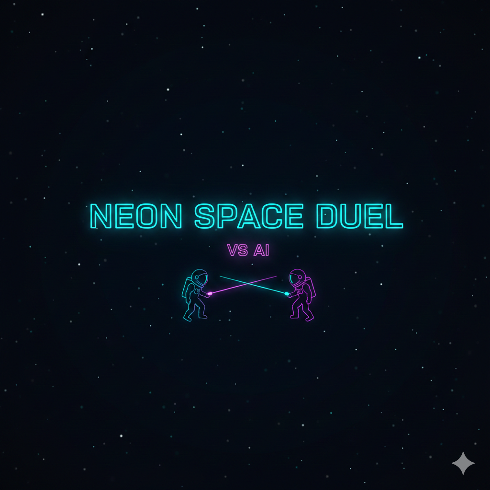
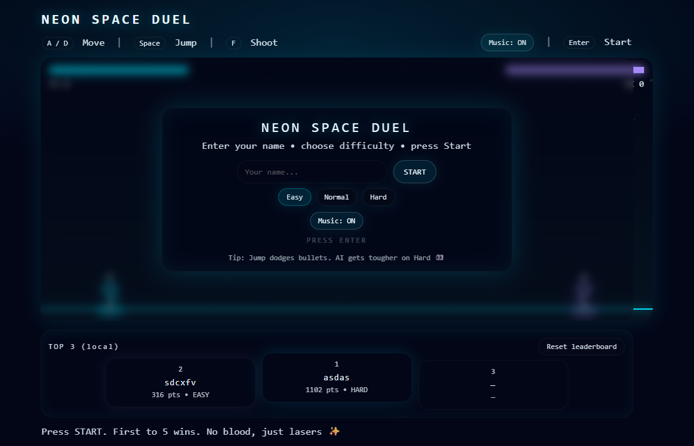
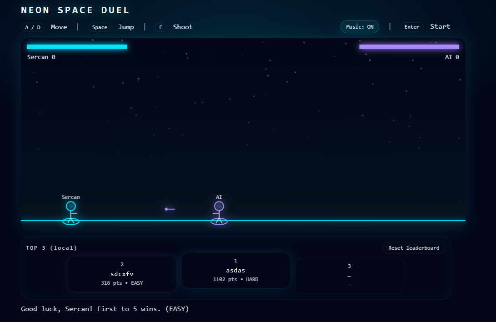
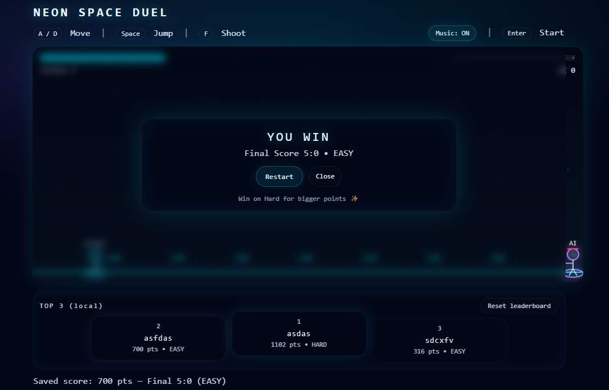

# Neon Space Duel — VS AI

A neon-lit 2D space duel where **you fight an AI** with lasers and jumps.  
Fast rounds, clean UI, and a **local Top 3 podium** that saves your best wins.

**Play here (GitHub Pages):** https://sercanozkan55.github.io/space-duel/

---

## 🎮 How to Play

### Controls
- **A / D** — Move
- **Space** — Jump
- **F** — Shoot
- **Enter** — Start (from the start menu)

### Goal
- **First to 5 wins** takes the match.
- You’ll get a **WIN / LOSE / DRAW** end screen.
- **DRAW** happens when both sides go down at the same time.

---

## 🧠 Difficulty & Scoring
Choose a difficulty in the start menu:

- **Easy / Normal / Hard**
- Hard makes the AI more aggressive and harder to dodge.

**Scoring (leaderboard):**
- Scores are saved **only when the player wins**.
- The **Top 3 podium is local** (stored in your browser using `localStorage`).
- Click **Reset leaderboard** to clear it.

> Note: Because it’s local, other people won’t see your scores unless they play on the same device/browser.

---

## 🎵 Music
The game includes built-in music using **WebAudio** (no external files).
- Toggle **Music: ON/OFF** from the UI.

---

## 📸 Screenshots

> Replace the placeholders below with your own screenshots.

### Start Menu

### Gameplay

### Win / Lose Screen

---

## 🚀 Deploying on GitHub Pages

1. Go to **Repo → Settings → Pages**
2. **Source:** Deploy from a branch  
3. **Branch:** `main`  
4. **Folder:** `/ (root)`  
5. Save — your site will be available at:
   `https://<username>.github.io/<repo>/`

---

## 🛠 Tech
- Single-file **HTML + Canvas**
- Styling included inside the same `index.html`
- `localStorage` for the Top 3 podium

---

## 📌 Notes / Future Ideas
- Online global leaderboard (requires a backend)
- More weapons & power-ups
- Smarter AI patterns

---

### License
MIT (optional — add a `LICENSE` file if you want)

